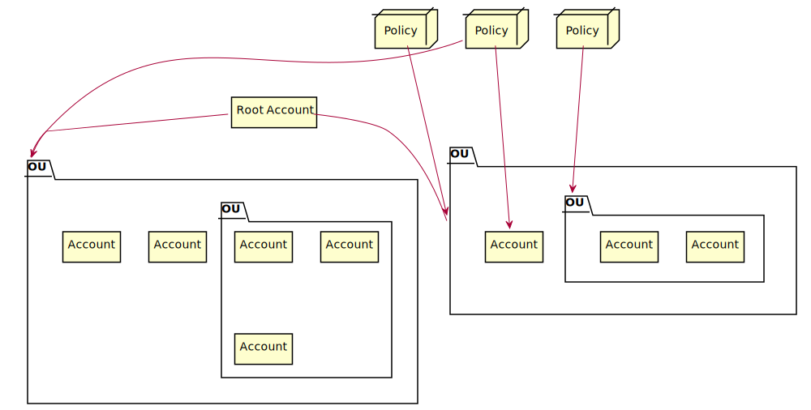

# Identity and Access Management
[IAM FAQ](https://aws.amazon.com/iam/faqs/)

Allows for the management of:
- Users
- Groups
- Roles
- Policies
- Certificates
for accessing AWS services and resources.

IAM is *universal* and does not apply to regions at this time. The *root account* is the account created when first setting up AWS and has complete administrator access. It's not a good idea to use this account and instead you should create one or more user accounts that have the Roles necessary to use AWS.

New users have no permissions when first created following the least-privilege design policy. New users are assigned an `Access Key ID` and `Secret Access Keys` when first created, these provide programmatic access but not AWS console access. You only get to view these once, if they're lost they must be regenerated. Users must be granted AWS console access (and provided a password to log in) to use the console.

Always set up Multi-factor Authentication (MFA) on the root account. You can create and customize password/password rotation policies and should follow NIST guidance for password management.

## Building Organizations
An account management service that enables you to consolidate multiple aws accounts into an organization that's centrally managed.



Accounts organized into Organizational Units (OUs), pretty standard directory management.

Policies are applied at the OU or Account level.

"Paying" account is indepdendent of linked accounts, linked accounts own and manage their resources in AWS. Consolidates billing to one account, volume pricing discount benefits.

## Policy Example

```
{
 "Version":"2012-10-17",
 "Statement":[
  {
   "Sid":"DirectoryTutorialsDojo1234",
   "Effect":"Allow",
   "Action":[
    "ds:*"
   ],
   "Resource":"arn:aws:ds:us-east-1:987654321012:directory/d-1234567890"
  },
  {
   "Effect":"Allow",
   "Action":[
   "ec2:*"
   ],
   "Resource":"*"
  }
 ]
}
```
In this policy, AWS Directory Service (`ds`) calls are allowed as long as the resource contains the directory id `d-1234567890` and all Elastic Cloud Compute (`ec2`) calls are allowed on any EC2 resource or subresource.

The `Principal` isn't set on IAM policies, when policies are attached to users (via roles), the `Principal` is implied.